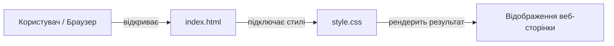

# Навчальний веб-проєкт


Простий статичний веб-сайт, створений у межах курсу «Програмне забезпечення ПК» для практичного освоєння Git, GitHub та оформлення технічної документації. 

Проєкт демонструє базову структуру веб-сторінки з підключеними стилями та контактною інформацією.

---

## Встановлення

Для роботи з проєктом на локальному комп'ютері потрібен лише встановлений `git` та будь-який сучасний браузер (Chrome, Firefox, Edge тощо).

1. Клонуйте репозиторій собі на ПК:
   ```bash
   git clone https://github.com/Marach-Roman/pr_3.git
   ```

2. Перейдіть у папку проєкту:
   ```bash
   cd pr_3
   ```

Додаткових залежностей чи пакетних менеджерів встановлювати не потрібно.

---

## Використання

Щоб відкрити та переглянути сайт локально:

- **Варіант 1 (через термінал Windows):**
  ```bash
  start index.html
  ```

- **Варіант 2 (через провідник):**  
  Двічі натисніть лівою кнопкою миші на файл `index.html` у папці з проєктом.

Після цього сторінка відкриється у вашому стандартному веб-браузері.

---

## Структура та технології проєкту

У проєкті використано чистий HTML та CSS без сторонніх фреймворків:

| Файл / Компонент | Призначення | Опис |
| :--- | :--- | :--- |
| `index.html` | Розмітка сторінки | Містить семантичні теги (`header`, `main`, `section`) та блок контактів |
| `style.css` | Оформлення | Задає шрифти, відступи, кольори фону та стилізацію інформаційного блоку |
| `README.md` | Документація | Опис проєкту, інструкція із запуску та структура |
| `LICENSE` | Ліцензія | Повний текст ліцензії MIT |

---

## Схема взаємодії

Схематичне відображення того, як браузер завантажує сторінку:



---

## Ліцензія

Цей проєкт розповсюджується за відкритою ліцензією MIT. Деталі та повний текст умов дивіться у файлі [LICENSE](LICENSE).

---

## Автори

- **Роман Марач** — розробник проєкту ([GitHub профіль](https://github.com/Marach-Roman))
- Студент групи з дисципліни «Програмне забезпечення ПК»
